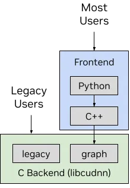

# CUDA_Buildup


 Storing and annotating the enlightening code (moment) in the process of **Parallel computing**  learning to backtrack the chain of thought in the future.

[Personal notes](https://www.yuque.com/g/hangtaili/dgelan/rsbgr0610q24gur1/collaborator/join?token=s6HcOiIqymvvLq8k&source=doc_collaborator# 《并行计算》)


## Code section 1: 

A simple network model

**组成部分**：

Operator（算子） : RELU, Convolution 2D, Flatten, fully Connect 

> Not only implement in parallel form, but also higher computation speed with the help of the NVIDIA CUDA （GPU）     （ CUDA-structured code 用CUDA的API实现)
>
> multi-operation fusion patterns：多算子融合减少内存访问、提高并行度、减小延迟

one abstract class Operator (pure virtual function)

simple inheritor: like RELU (只需要实现forward函数，做简单的变化，类中不需要新建成员变量来存储weight 和 bias)

comlicated inheritor：like Conv （构造函数初始化不同大小的卷积核，存储weight和bias，未来还需要Backpropagation）


Class DeviceTensor: following the C++ RAII thought, DeviceTensor is used to manage the lifecycle of the GPU allocated memory （实现中但凡需要申请显存都用这个类来实例化）


CUDA kernel：How to abstract need to go back to the principles of Math


Class Sequential:  using Vector to form a simple model which is composed of serial operators.

(形成最终模型的结构 + forward函数来处理输入X，得到输出)


## Code section 2:

A simple example of how to use API of the Cublas and CublasLt for matrix multiplication.


Key point:

1. Before estimation the performance of GPU, it needs warm-up.

2. In CUDA's execution model, an event is queued as a command in a stream

   ```
   CHECK_CUDA(cudaEventRecord(start));
   kernel_func();
   CHECK_CUDA(cudaEventRecord(stop));
   CHECK_CUDA(cudaEventSynchronize(stop));
       
   CHECK_CUDA(cudaEventElapsedTime(&elapsed_time, start, stop))
   gpu先执行start event，再执行kernel，再执行stop， 而sync只是阻塞主线程等待stop event的运行结束

3. why the cublastLt is more complex than cublas?

   > cublas的API需要和blas保持兼容
   >
   > cublasLt**为了更高性能、更灵活的优化路径**，NVIDIA 把计算过程的每一步都“显式化”，你可以精细控制它的：
   >
   > - 计算方式（比如 Tensor Core vs 普通 FMA）；
   > - 数据布局（row-major, col-major, tensor NHWC/NCHW 等）；
   > - 内存复用（reorder 缓存）；
   > - 并行策略（tile size/block size/stream 等）；
   > - 混合精度（比如 FP32 accumulate on FP16 input）；
   >
   > **这些在 cublas 老接口中是写死的，而在 cublasLt 中是开放出来的。

   

4. The flow of  cublasLt execution : **Handle-Create-Layout-Desc-Layout-Execute-Destroy**

5. The result of experiment：

   

## Code Section 3:

The simple example of the cuDNN usage (excluding the usage of the cuDNN frontend(computation graph))

2d muti-channel convolution computation



1. **creat** cudnnhandle, xxtype_desciptor
2. Set the attribute

> **卷积核大小**：指的是卷积核的宽度和高度，通常用 `(H, W)` 来表示，其中 `H` 是高度，`W` 是宽度。常见的卷积核尺寸有 `(3, 3)`、`5, 5`、`7, 7` 等。
>
> **输入通道数（In Channels）**：指的是输入数据的通道数，比如彩色图像通常有 3 个通道（RGB），而灰度图像只有 1 个通道。
>
> **输出通道数（Out Channels）**：指的是卷积操作后得到的输出数据的通道数。通过增加输出通道数，卷积层可以提取更多的特征。
>
> **步长（Stride）**：卷积核在输入数据上滑动的步长。步长决定了卷积操作的输出尺寸，如果步长为 1，卷积核会在每个位置都执行一次卷积操作；步长为 2 时，卷积核会跳过每两个位置。
>
> **填充（Padding）**：为保持输入和输出的尺寸关系，可以在输入的边界添加零值，这叫做填充。常见的填充方式有“valid”和“same”：
>
> - **Valid padding**：不添加填充，卷积核只能覆盖完全在输入数据内部的区域。
> - **Same padding**：通过填充保证输出尺寸与输入尺寸相同（适用于步长为 1 的情况）。
>
> **权重（Weights）**：卷积核的参数本身，即每个卷积核元素的数值。权重通常在训练过程中通过反向传播进行学习和优化。
>
> **偏置（Bias）**：卷积操作后，每个输出通道通常会加上一个偏置项。偏置的作用是帮助模型更好地拟合数据。

3. select the machted algorithm
4. allocate the the workspace and kernel memory size
5. forward running
