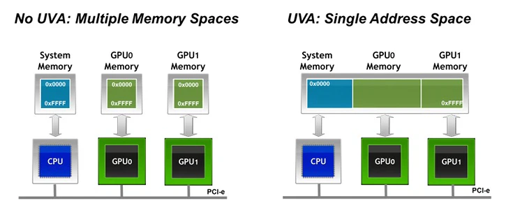

# CUDA_Buildup


 Storing and annotating the enlightening code (moment) in the process of **Parallel computing**  learning to backtrack the chain of thought in the future.

[Personal notes](https://www.yuque.com/g/hangtaili/dgelan/rsbgr0610q24gur1/collaborator/join?token=s6HcOiIqymvvLq8k&source=doc_collaborator%23%20%E3%80%8A%E5%B9%B6%E8%A1%8C%E8%AE%A1%E7%AE%97%E3%80%8B)


## Code section 1: 

A simple network model

**组成部分**：

Operator（算子） : RELU, Convolution 2D, Flatten, fully Connect 

> Not only implement in parallel form, but also higher computation speed with the help of the NVIDIA CUDA （GPU）     （ CUDA-structured code 用CUDA的API实现)
>
> multi-operation fusion patterns：多算子融合减少内存访问、提高并行度、减小延迟

one abstract class Operator (pure virtual function)

simple inheritor: like RELU (只需要实现forward函数，做简单的变化，类中不需要新建成员变量来存储weight 和 bias)

comlicated inheritor：like Conv （构造函数初始化不同大小的卷积核，存储weight和bias，未来还需要Backpropagation）


Class DeviceTensor: following the C++ RAII thought, DeviceTensor is used to manage the lifecycle of the GPU allocated memory （实现中但凡需要申请显存都用这个类来实例化）


CUDA kernel：How to abstract need to go back to the principles of Math


Class Sequential:  using Vector to form a simple model which is composed of serial operators.

(形成最终模型的结构 + forward函数来处理输入X，得到输出)


> 虽然整个代码比较初级和简单，但具有学习的意义。
>
> 1. 利用了c++的特性
>
> 算子和输入和输出都使用class来抽象管理（生命周期），继承，RAII
>
> 2. 网络概念到代码实现的借鉴demo例子
>
> 每个算子类实现forward函数，并在函数中调用了cuda kernel
>
> 3. 一个sequential类把所有算子串起来，实现简单的网络连接

## Code section 2:

A simple example of how to use API of the Cublas and CublasLt for matrix multiplication.


Key point:

1. Before estimation the performance of GPU, it needs warm-up.

2. In CUDA's execution model, an event is queued as a command in a stream

   ```
   CHECK_CUDA(cudaEventRecord(start));
   kernel_func();
   CHECK_CUDA(cudaEventRecord(stop));
   CHECK_CUDA(cudaEventSynchronize(stop));
       
   CHECK_CUDA(cudaEventElapsedTime(&elapsed_time, start, stop))
   gpu先执行start event，再执行kernel，再执行stop， 而sync只是阻塞主线程等待stop event的运行结束

3. why the cublastLt is more complex than cublas?

   > cublas的API需要和blas保持兼容
   >
   > cublasLt**为了更高性能、更灵活的优化路径**，NVIDIA 把计算过程的每一步都“显式化”，你可以精细控制它的：
   >
   > - 计算方式（比如 Tensor Core vs 普通 FMA）；
   > - 数据布局（row-major, col-major, tensor NHWC/NCHW 等）；
   > - 内存复用（reorder 缓存）；
   > - 并行策略（tile size/block size/stream 等）；
   > - 混合精度（比如 FP32 accumulate on FP16 input）；
   >
   > **这些在 cublas 老接口中是写死的，而在 cublasLt 中是开放出来的。

   

4. The flow of  cublasLt execution : **Handle-Create-Layout-Desc-Layout-Execute-Destroy**

5. The result of experiment：

   

## Code Section 3 & Section 4

The simple examples of the cuDNN usage (excluding the usage of the cuDNN frontend(computation graph))


cuDNN 偏向于 **深度学习张量计算**(DLC)，例如：

- 卷积（`cudnnConvolutionForward`）
- 激活（`cudnnActivationForward`）
- 批归一化（`cudnnBatchNormalizationForwardTraining`）
- 池化（`cudnnPoolingForward`）


**2d convolution computation **

> | 卷积类型 | 输入Tensor 维度     | 是否支持       |
> | -------- | ------------------- | -------------- |
> | Conv1D   | 3D: [N, C, L]       | ✅              |
> | Conv2D   | 4D: [N, C, H, W]    | ✅              |
> | Conv3D   | 5D: [N, C, D, H, W] | ✅              |
> | Conv4D+  | 6D 或 7D            | ❌ cuDNN 不支持 |
>
> 卷积+ 2 = 输入的维度

确定输入输入/输出，卷积核（filter）tensor的大小，卷积配置/卷积算法的选择,分配合适的选择


> H_out = ⎣ (H_in + 2·pad_h − dilation_h·(kernelSize−1) − 1) / stride_h ⎦ + 1
> W_out = ⎣ (W_in + 2·pad_w − dilation_w·(kernelSize−1) − 1) / stride_w ⎦ + 1
>
> 5X5X3 与 3X3X3 进行2d卷积 获得的是一个3X3矩阵
>
> 输入input：input[batchSize] [inChannels] height] [width] （每个数据为W\*H\*C,总共有batch个，4D）
>
> **卷积核大小**：kernel[outChannels] [inChannels] [kernelSize] [kernelSize] （因为矩阵要能卷积必须维度匹配，所以每个卷积核为K\*K\*C 总共有output个，不同的核心对不同的特征进行提取）
>
> **输入通道数（In Channels）**：指的是输入数据的通道数，比如彩色图像通常有 3 个通道（RGB），而灰度图像只有 1 个通道。
>
> **输出通道数（Out Channels）**：指的是卷积操作后得到的输出数据的通道数。通过增加输出通道数，卷积层可以提取更多的特征。（**决卷积核的数量**）
>
> **膨胀卷积（Dilated）**：通过在卷积核元素之间“插入空洞”来**扩大感受野**的一种技术，会影响卷积核实际运算的大小
>
> 
>
> 虽然我们只存 3×3 = 9 个权重（最初的 x 位置），
>
> 但它们在输入上覆盖了 5×5 的“虚拟网格”。
>
> **步长（Stride）**：卷积核在输入数据上滑动的步长。步长决定了卷积操作的输出尺寸，如果步长为 1，卷积核会在每个位置都执行一次卷积操作；步长为 2 时，卷积核会跳过每两个位置。
>
> **填充（Padding）**：为保持输入和输出的尺寸关系，可以在输入的边界添加零值，这叫做填充。常见的填充方式有“valid”和“same”：
>
> - **Valid padding**：不添加填充，卷积核只能覆盖完全在输入数据内部的区域。
> - **Same padding**：通过填充保证输出尺寸与输入尺寸相同（适用于步长为 1 的情况）。
>
> **权重（Weights）**：卷积核的参数本身，即每个卷积核元素的数值。权重通常在训练过程中通过反向传播进行学习和优化。
>
> **偏置（Bias）**：卷积操作后，每个输出通道通常会加上一个偏置项。偏置的作用是帮助模型更好地拟合数据。


**2d muti-channel convolution computation  and activation function **

1. **creat** cudnnhandle, xxtype_desciptor
2. Set the attribute  （conv = filter(卷积核) + conv(卷积方式)     （activation=激活属性设置）
3. select the machted algorithm （options）
4. allocate the the workspace and kernel memory size
5. forward running


For the result of activation function, it's clear the GPU significantly reduce the computation time.


## Code Section 5

Refine the matrix multiplication by using the on-chip memory (decrease the times of reading global memory)


on-chip memory: shared memory  and L1 cache

> share memory 编程管理
>
> L1（同一个SM可见） + L2 （所有SM可见）硬件自动管理


**key point: Tiling（矩阵瓦片化运算） + shared memory （共享内存减少读取次数）   **

> 底层原理：一个block 里的thread负责计算一个Csub，那么这个block里所需进行计算的数据不需要重复读写，每个线程读取在shared memory中共同使用，减少对global memory的读取


每个thread依然还是计算得出结果矩阵中的一位结果，但是结果矩阵被拆分成了多个Csub（每个block对应一个Csub），那么一个Csub中的计算就可以使用block的共享内存 \__shared__减少数据对全局内存的读写次数：

*A* is only read (*B.width / block_size*) times from global memory and *B* is read (*A.height / block_size*) times.

> 传统的MM：*A* is therefore read *B.width* times from global memory and *B* is read *A.height* times.
>
> 同一个数据被重复读了很多次
>
> 因为结果是A.height X B.width 所以每一行要乘B.width次， 每一列要乘A.height次


每一个Csub大小为blocksize X blocksize，那么它们就需要A的 blocksize* A.width  与B.height * blocksize 进行对应的矩阵相乘（其实一个结果元素依然是一行乘一列），但既然我们有block中的线程，我们可以用他们分别读取变量到shared memory中，然后用__syncthreads()同步，最后写入，减少读写的次数

```
for (int m = 0; m < (A.width / BLOCK_SIZE); ++m) {
        // Get sub-matrix Asub of A
        Matrix Asub = GetSubMatrix(A, blockRow, m);
        // Get sub-matrix Bsub of B
        Matrix Bsub = GetSubMatrix(B, m, blockCol);
        // Shared memory used to store Asub and Bsub respectively
        __shared__ float As[BLOCK_SIZE][BLOCK_SIZE];
        __shared__ float Bs[BLOCK_SIZE][BLOCK_SIZE];
        // Load Asub and Bsub from device memory to shared memory
        // Each thread loads one element of each sub-matrix
        As[row][col] = GetElement(Asub, row, col);
        Bs[row][col] = GetElement(Bsub, row, col);
        // Synchronize to make sure the sub-matrices are loaded
        // before starting the computation
        __syncthreads();
        // Multiply Asub and Bsub together
        for (int e = 0; e < BLOCK_SIZE; ++e)
            Cvalue += As[row][e] * Bs[e][col];
        // Synchronize to make sure that the preceding
        // computation is done before loading two new
        // sub-matrices of A and B in the next iteration
        __syncthreads();
    }
```

这个循环中，其实是把A * B 切成了对应的块，每个块对应相乘，最后多个块类加（等价于一行乘一列）


## Code Section 6 

using nvidia libraries to load a trained caffe model and transfer to tensorRT form for inference

> 这个代码最复杂的工作都是调库，但是完整的完成了图片加载/模型加载，转化为TensorRT，进行推理
>
> API stream：create -》 init_model -> load_model -> load_engine ....


主要需要注意的是：

输入源图片：从disk中载入到了内存中

模型转换：caffe -》 tensorRT （转换后就可以使用推理库加速inference)

模型推理：将图片搬运到显存中，推理完送回内存


这个代码中调库并没有参数区选择gpu，可以参考库的源码确定如何实现的

1. 图片加载器
2. caffe模型载入，并使用tensorRT优化、
3. 进行推理

> 可以回溯到code section1的代码，就可以看出那个代码非常的naive。
>
> 首先网络模型不太可能是简单的串形，其次不可能每个算子运算都去开启一个kernel，走一遍内存-显存-运算-回内存的流程，开销太大
>
> 换一句话说我有了模型结构和参数，但没有gpu进行硬件加速，那一切就没有意义，多层的网络模型DAG 对应着NVidia的多个算子库进行最终的运算,真实运算需要算子融合
>
> 


# Code Section 7

**前提**

Host 和 GPU 都有自己对应的DRAM，虚拟地址空间（MMU和页表）


内存中锁定一段地址空间（page-locked memory：不会被换到交换区），并把他映射到GPU的地址空间中。GPU 内核可以通过特定device指针访问同一段主机内存。需要注意的是，映射内存本质上仍驻留在主机内存中，GPU 访问时会通过 PCIe 总线发起 DMA 传输；并不会自动在显存中开辟一块镜像空间

> 分配页锁定地址：cudaHostAlloc(&cpu, size, cudaHostAllocMapped)
>
> 把这段空间映射到GPU地址空间中：cudaHostGetDevicePointer(&gpu, cpu, 0)

 CUDA 驱动将这块主机内存暴露给 GPU 地址空间。当 GPU 内核使用指向该映射主机内存的指针时，会在访问时触发 PCIe 传输以从主机端内存载入或写回数据。因此，采用映射内存的方法可以省去显存拷贝，但 GPU 访问速率受限于 PCIe 带宽而低于本地显存速度。


1. 非UVA模式下：各自使用独立的虚拟地址空间

在不支持 UVA 的老系统里，CPU 的虚拟地址从 0x0000_0000_0000 到 0x7FFF_FFFF_FFFF，GPU 的虚拟地址也是它自己的一个 32‑bit 或 40‑bit 空间，两者互不相干

**case： cpu ！gpu：就是等价于把一段内存地址放到gpu的地址空间上方便访问，但这个内存的设备地址和内存地址是不一样的**

​     

2. UVA：统一虚拟地址空间

程序以 64‑bit 模式运行，且 GPU 架构 ≥ Fermi（Compute Capability 2.0），CUDA 运行时就会“自动”使用统一虚拟寻址（UVA）

**地址放到一个虚拟地址空间，但页表里没有映射，也访问不了**

> 特别注意：
>
> 1. 统一虚拟地址空间不代表cpu/gpu就可以不分逻辑，随便访问数据，他只是用于专门管理的 **页锁定内存pinned memory** 和**managed memory**
> 2. UVA（Unified Virtual Addressing）的“统一”指的并不是「把所有内存都挂到 CPU 和 GPU 的页表里」，而是「给 CPU 分配的指针和给 GPU 分配的指针，落在同一个 64‑bit 虚拟地址范围里


**case： cpu == gpu：和上面就不同了**




想象一个大型室内停车场，车位编号从 1 到 1,000,000。不同品牌的车（CPU、GPU、映射内存）都在这一个车库里找号，但只有被授权的入口（页表映射）才能把车开进去

> 所以不管是不是UVA：使用普通的 `cudaMalloc()` 在设备上分配内存时，该内存仅位于显存中，是给类似kernel操作的，CPU 必须通过 `cudaMemcpy` 显式拷贝才能访问
